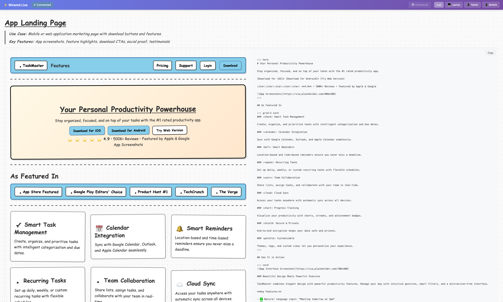

# CLI

The wiremd CLI converts `.md` files to HTML, watches for changes, and optionally serves a live-reload dev server.

No terminal? [Install the VS Code extension](./vscode.md) instead.

## Install

```bash
npm install -g wiremd
```

Verify:

```bash
wiremd --version
```

## Serve locally

The most useful workflow — write your wireframe, see it update live in any browser:

```bash
wiremd my-screen.md --serve 3001 --watch
```

Open `http://localhost:3001`. The page reloads automatically on every save. Works in any browser including Firefox.



For a whole folder of screens:

```bash
wiremd ./screens --serve 3001
```

All `.md` files under `./screens` are watched. If `screens/index.md` exists it becomes the default page. Navigate between screens at `http://localhost:3001/screen-name.html`.

## One-shot render

```bash
# Render to HTML (default: same name as input)
wiremd login.md

# Specify output path and style
wiremd login.md -o dist/login.html --style clean
```

## Flags

| Flag | Alias | Default | Description |
|------|-------|---------|-------------|
| `--output <file>` | `-o` | `<input>.html` | Output file path |
| `--style <style>` | `-s` | `sketch` | Visual style |
| `--serve <port>` | — | — | Start live-reload dev server on port |
| `--watch` | `-w` | — | Regenerate on file change (no server) |
| `--format <format>` | `-f` | `html` | `html` or `json` |
| `--show-comments` | — | off | Render `<!-- comments -->` as callout panels |
| `--watch-pattern <glob>` | — | — | Override the default watch glob |
| `--ignore <glob>` | — | — | Extra glob to exclude from watching |
| `--pretty` | `-p` | `true` | Pretty-print output |
| `--version` | `-v` | — | Print version |
| `--help` | `-h` | — | Print help |

### Styles

| Value | Look |
|-------|------|
| `sketch` | Balsamiq-inspired hand-drawn (default) |
| `clean` | Modern minimal |
| `wireframe` | Traditional grayscale |
| `material` | Google Material Design |
| `tailwind` | Utility-first, purple accents |
| `brutal` | Neo-brutalism, bold colors |
| `none` | Unstyled HTML |

## Notes

- `--serve` starts the server but does **not** auto-enable `--watch`. Pass both to get live reload: `--serve 3001 --watch`.
- `--watch` without `--serve` regenerates the file on disk only — no browser sync.
- Directory mode ignores `-o`. Use `-s` to set the style for all files.

## Programmatic use

```bash
npm install wiremd
```

```ts
import { parse, renderToHTML } from 'wiremd'

const html = renderToHTML(parse('## Login\n[Sign In]*'), { style: 'clean' })
```

Full API: [Parser](/api/parser) · [Renderers](/api/renderer)
