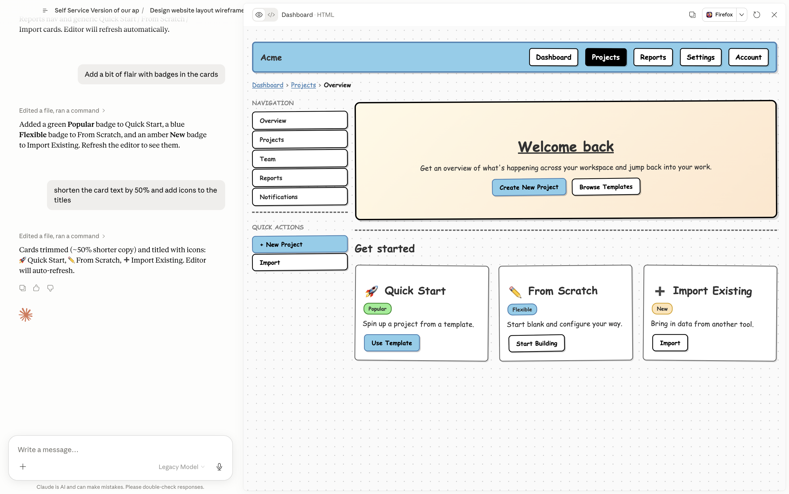
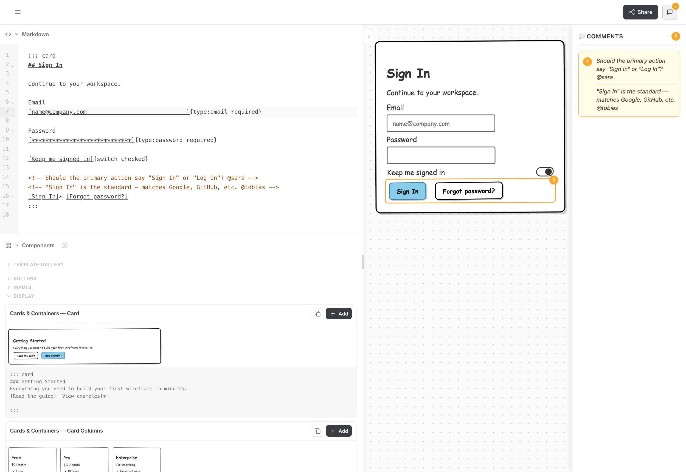

# wiremd

**Wireframes in plain text.**

Write a screen as Markdown, see it render as a visual mockup — no design tool, no drag-and-drop.

<WmdPipeline />

<div class="doc-shots-2" style="margin-top:1.5rem">
  
  
</div>

---

## What you can do with it

| | |
|---|---|
| **Create** | Describe a screen — Claude writes the Markdown and renders it instantly |
| **Share** | Copy a link, embed in Notion, paste in Jira or Obsidian — the wireframe travels with the spec |
| **Stay portable** | Everything is a `.md` file — version-controlled, diff-able, readable by any LLM |
| **Hand off** | Open in VS Code or pass to Claude Code — plain text, no screenshots, no translation layer |

---

## Get started

### Web editor — no install

Open **[teezeit.github.io/wiremd/editor](https://teezeit.github.io/wiremd/editor/)** in Chrome, Edge, or Safari. Paste or write wiremd Markdown, pick a style — renders instantly. No account, no setup.

### With Claude

Describe the screen you want — Claude writes and renders the wireframe for you.

**Claude Code:**
```bash
npx skills add teezeit/wiremd/extensions/skills
```

**Claude Desktop Cowork:** download [wireframe-skill.zip](https://github.com/teezeit/wiremd/releases/latest/download/wireframe-skill.zip) → Settings → Plugins → + Add → Upload (`.zip`) (recommended), or Settings → Skills → + Add → Upload (`.zip`).

Full rendering (serve/watch modes) requires local CLI access — Claude Code and Claude Desktop Cowork. In chat contexts, the bundled CLI runs in the sandbox for display mode; or paste the Markdown into the [web editor](https://tobiashoelzer.com/wiremd/editor/) to render it.

Three modes — see the [full guide](./claude.md) to pick yours:

- **Only Claude** (`/wireframe:display`) — HTML artifact in Claude's panel, no browser tab
- **Claude + Editor** (`/wireframe:editor`) — live browser tab, both sides read/write the `.md`
- **Only Editor** — paste Claude's output into the web editor, no install

### VS Code extension

Install the [VS Code extension](./vscode.md) — open any `.md` file, click the preview icon. Live preview as you type, no terminal needed.

### Local dev server

```bash
npm install -g @eclectic-ai/wiremd
wiremd my-wireframe.md --serve --watch
```

Open the printed `http://localhost:PORT` address — reloads on every save. Works with any browser, including Firefox. [Install guide →](./installation.md)

---

## Next steps

- [Using with Claude](./claude.md) — full guide for all Claude surfaces
- [Components](../components/) — all components and attributes
- [Examples](../examples/) — full-page wireframe templates
