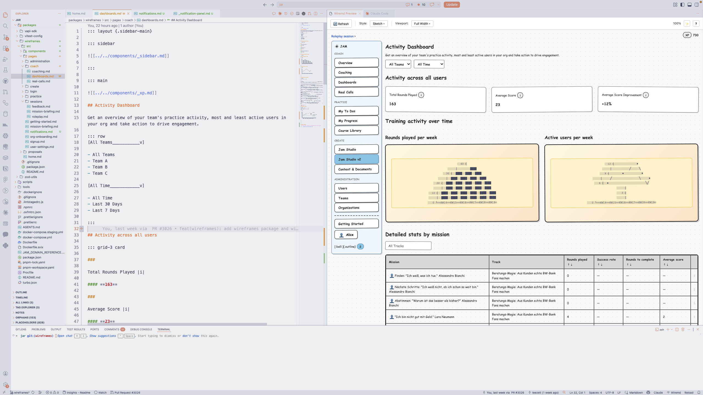

# VS Code Extension

The wiremd VS Code extension gives a live preview of any `.md` wireframe as you type — no terminal required.

## Install from the Marketplace

1. Open the Extensions panel in VS Code (`Cmd+Shift+X` on Mac, `Ctrl+Shift+X` on Windows/Linux)
2. Search **wiremd preview**, or open the [marketplace page](https://marketplace.visualstudio.com/items?itemName=eclectic-ai.wiremd-preview) directly
3. Click **Install**

That's it. No Node.js or terminal setup needed.

## Open the preview

Open any `.md` file, then open the preview using any of these:

- Click the **wiremd** item in the VS Code status bar (bottom of the window)
- Press `Cmd+K V` (Mac) or `Ctrl+K V` (Windows/Linux)
- Open the Command Palette (`Cmd+Shift+P`) → **wiremd: Open Preview to the Side**
- Click the preview icon in the editor toolbar (top-right when editing a markdown file)

The preview panel opens alongside your editor and updates live as you type.



## Change the visual style

Use the style dropdown in the preview toolbar to switch between:

| Style | Look |
|---|---|
| `sketch` | Balsamiq-inspired hand-drawn (default) |
| `clean` | Modern minimal |
| `wireframe` | Traditional grayscale |
| `material` | Google Material Design |
| `tailwind` | Utility-first with purple accents |
| `brutal` | Neo-brutalism, bold colors |
| `none` | Unstyled HTML |

You can also set a default in your VS Code settings:

```json
// .vscode/settings.json
{
  "wiremd.defaultStyle": "clean"
}
```

## Preview at different screen sizes

Click the **Viewport** button in the preview toolbar to pick a size: Desktop, Laptop, Tablet, Mobile, or Full Width.

## Toggle inline comments

Click the **💬 Comments On/Off** button in the preview toolbar to show or hide inline comment callouts. Comments are written as standard HTML comments in your markdown:

```markdown
<!-- Is this the right CTA? @sara -->
[Sign Up]*
```

When visible, they render as yellow sticky-note callouts. Toggle them off for a clean view without changing the source file.

## Browse the component reference

Click the **?** button in the preview toolbar to open the component docs — a rendered, interactive reference of every wiremd component, served directly from the extension.

## Claude skill (optional)

On first launch, the extension offers to install the wiremd Claude skill:

> "Want Claude Code to generate wireframes for you? Install the Claude skill."

Click **Install Skill** to copy the skill into `.claude/skills/wireframe/` in your workspace. This lets Claude Code understand wiremd syntax and generate wireframes from descriptions or specs. Click **Not Now** to skip — you can always install it later via the Command Palette: **wiremd: Install Claude Skill**.

If you don't use Claude Code, skip this.

---

## Build from source

If you want to modify the extension or use an unreleased build:

```bash
git clone https://github.com/teezeit/wiremd.git
cd wiremd
pnpm install
pnpm turbo run build
pnpm --filter wiremd-preview run bundle
code --extensionDevelopmentPath=$(pwd)/extensions/vscode .
```

See [`extensions/vscode/DEVELOPMENT.md`](https://github.com/teezeit/wiremd/blob/main/extensions/vscode/DEVELOPMENT.md) for the full contributor workflow, including how to rebuild after changes to the wiremd library.
