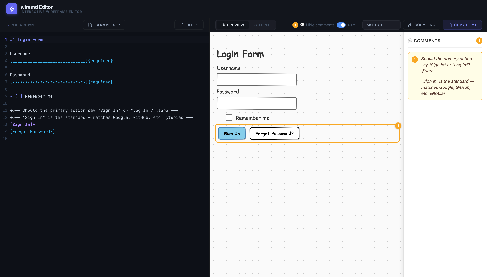

# Web Editor

Open **[teezeit.github.io/wiremd/editor](https://teezeit.github.io/wiremd/editor/)** in Chrome, Edge, or Safari — no install, no account, no setup.



## Write or paste wiremd Markdown

Type directly in the editor, or ask Claude to write wiremd Markdown for you and paste it in. Pick a style — the wireframe renders instantly.

## Share via URL

Click **Copy Link** — the editor encodes the current wireframe into the URL. Paste it anywhere: Notion, Jira, Slack, email. Anyone who opens the link sees the rendered wireframe.

```
https://teezeit.github.io/wiremd/editor/#code=MTAEBEEMGcAsCMD2kBOATAUBgXL0BzFASzQF…
```

## Live sync with Claude Code or Claude Desktop

If you have Claude Code or Claude Desktop running on the same machine, Claude can write directly to a `.md` file and the editor will sync live — no copy-pasting needed. This is [Mode 2](./claude.md#claude-and-editor) in the Claude guide.

## Browser compatibility

The editor works in Chrome, Edge, and Safari 16.4+. Firefox is supported for editing and sharing via URL, but live file sync requires the File System Access API which Firefox doesn't support.
