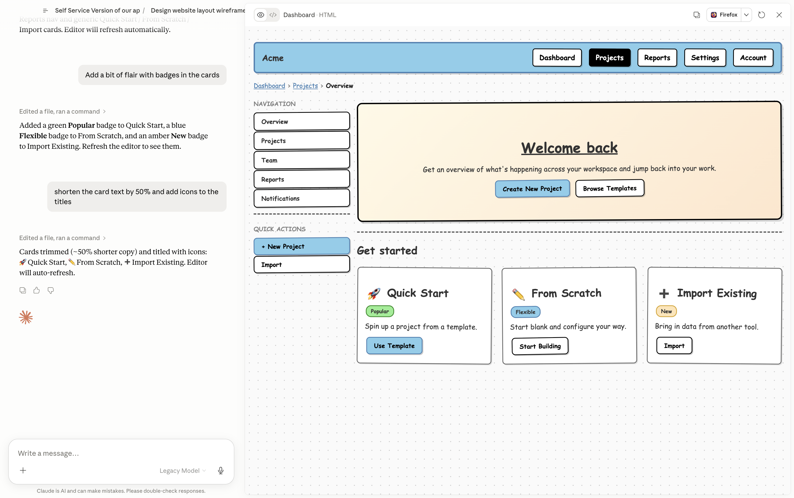

# Using wiremd with Claude

Three modes — pick based on what you want to see:

| Mode | What you see |
|------|--------------|
| **display** | HTML wireframe as an artifact in Claude's panel |
| **editor** | Live browser tab — Claude and the editor both read/write |
| **serve** | Local dev server at `localhost:PORT` — any browser |

Run `/wireframe` and Claude will ask which mode you want before doing anything else.

Install once to unlock Claude mode:

```
/plugin marketplace add teezeit/wiremd
/plugin install wireframe@wiremd
```

---

## Mode 1 — Only Claude {#only-claude}

Select **display** when Claude asks for a mode. Claude writes the `.md` file, runs the bundled wiremd CLI to render HTML, and shows the result as an artifact in its panel. No browser tab, no manual refresh.

Works on Claude Desktop, claude.ai, and Claude Code.

### How it works

1. Describe the screen you want
2. Claude writes `wireframe.md` and renders it:
   ```bash
   wiremd wireframe.md -o wireframe.html -s sketch
   ```
3. The rendered wireframe appears in Claude's panel
4. Give feedback — Claude edits the `.md`, re-renders, panel updates

### What you can ask

- "Wireframe a settings page — profile, notifications, billing tabs"
- "Add a sidebar with navigation and show the active state on Overview"
- "Show the empty state for the table — no data yet, with an Add button"

---

## Mode 2 — Claude + Editor {#claude-and-editor}

Select **editor** when Claude asks for a mode. Claude writes a `.md` file, the browser editor opens it — and from that point both sides can edit. Claude edits the file and the browser updates live; you edit in the browser and Claude can read your changes too.

Works with Claude Code or Claude Desktop (Cowork) running on the same machine as your browser.

<div class="doc-shots-2">
  
  
</div>

<div class="flow-diagram">
  <div class="flow-node">
    
    <span class="flow-node__label">Claude Desktop<br/>· Claude Code</span>
  </div>
  <div class="flow-edge">
    <span class="flow-edge__arrow">⇄</span>
  </div>
  <div class="flow-file">
    <svg class="flow-file__icon" width="18" height="18" viewBox="0 0 24 24" fill="none" stroke="currentColor" stroke-width="2" stroke-linecap="round" stroke-linejoin="round"><path d="M14 2H6a2 2 0 0 0-2 2v16a2 2 0 0 0 2 2h12a2 2 0 0 0 2-2V8z"/><polyline points="14 2 14 8 20 8"/><line x1="16" y1="13" x2="8" y2="13"/><line x1="16" y1="17" x2="8" y2="17"/></svg>
    <code class="flow-file__name">wireframe.md</code>
    <span class="flow-file__sync">live sync</span>
  </div>
  <div class="flow-edge">
    <span class="flow-edge__arrow">⇄</span>
  </div>
  <div class="flow-node">
    
    <span class="flow-node__label">Browser<br/>editor</span>
  </div>
</div>

### How it works

1. Ask Claude to wireframe something
2. Claude writes the `.md` file and gives you a browser link
3. Open the link in Chrome, Edge, or Safari 16.4+ → click **Open File** → grant access once
4. The wireframe appears and updates live as Claude edits
5. You can also type directly in the browser editor — changes save back to the file

### Modes

| Mode | Use when |
|------|----------|
| **editor** | Default — File System Access API, Chrome/Edge/Safari |
| **serve** | Firefox or any browser — starts `localhost:3001` with hot-reload |
| **display** | You want a rendered HTML artifact instead of a live browser tab |

### What you can ask

- "Wireframe a login screen with email, password, and a forgot password link"
- "Sketch the settings page for this app"
- "Draw what the dashboard would look like — nav, a metrics row, a table below"
- "Mockup a confirmation modal for deleting an account"
- "Document this component as a wireframe" *(with a React/JSX file open)*

### Iterating

Keep talking — Claude edits the `.md` file and the preview updates live:

- "Add a sidebar with navigation links on the left"
- "Replace the table with a card grid"
- "Show the empty state — no items yet, with an Add button"
- "What does the mobile layout look like?"

---

## Mode 3 — Only Editor {#only-editor}

No install, no Claude skill needed. Ask Claude (in any chat) to write wiremd Markdown, copy the output, and paste it into the editor. Pick a style — renders instantly.

[Web Editor guide →](./web-editor.md)

---

## Tips

- **Be specific about layout.** "Two-column grid, nav on the left, content on the right" works better than "a typical dashboard layout."
- **Name the states you need.** "Show the loading state for the Submit button" or "Add an error message under the email field."
- **You don't need to know wiremd syntax.** Describe what you want visually — Claude translates it.
