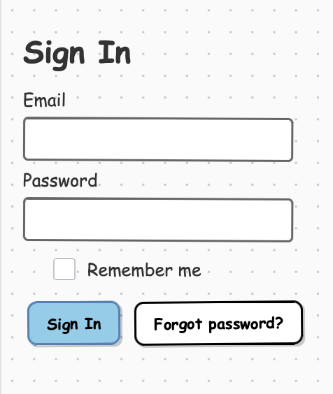

# wiremd

**Wireframes in plain text.**

Write a screen as Markdown, see it render as a visual mockup — no design tool, no drag-and-drop.

```markdown
## Login

Email
[_____________________________]{type:email}

Password
[_____________________________]{type:password}

[Sign In]* [Forgot password?]
```



---

## Get started

**No terminal?**
[Install the VS Code extension](./vscode.md) — open any `.md` file, click the preview icon. Done.

**Want to describe it?**
[Use Claude](./claude.md) — tell Claude what screen you want, it writes and renders the wireframe for you.

**CLI:**

Install:

```bash
npm install -g wiremd
```

Create `my-wireframe.md`, then render with live reload:

```bash
wiremd my-wireframe.md --style clean --serve 3001 --watch
```

Open `http://localhost:3001`. The preview reloads as you save.

---

## Next steps

- [VS Code extension](./vscode.md) — live preview while editing
- [Using with Claude](./claude.md) — generate wireframes from descriptions
- [Components](../components/) — all components and attributes
- [Examples](../examples/) — full-page wireframe templates
